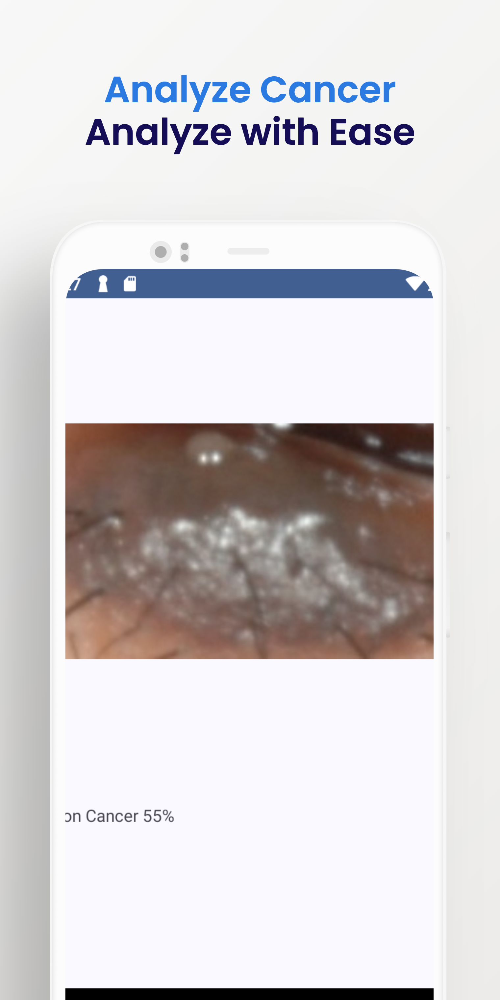

Harmonia
========

Harmonia is your ultimate tool for real-time news updates, image analysis, and seamless profile management.

Screenshot
===========
   

Changelog
---------

v1.0 - Main Feature

- Cancer Detector using TensorflowLite
- Customizable Splashscreen
- Feed News About Cancer
- Login with Firebase